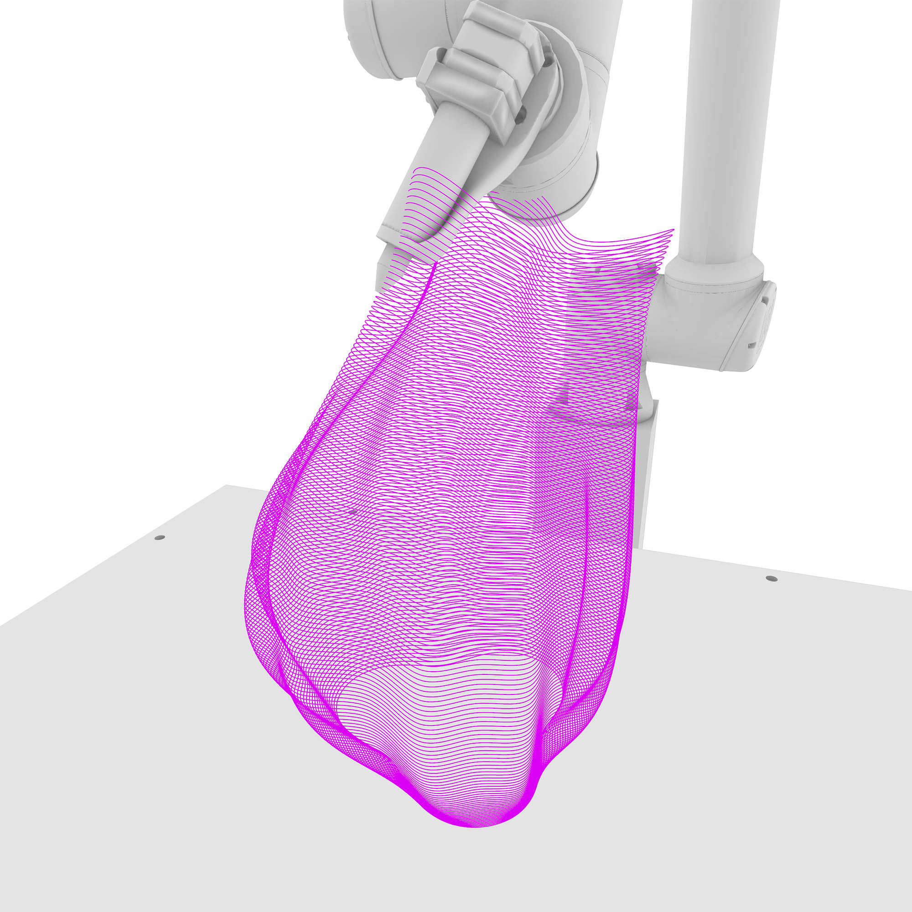

# Robotic Printing
###### Open-source Grasshopper definitions for 3D printing with a UR robotic arm, tailored for various extrusion processes

This repository contains Grasshopper definitions designed for 3D printing with a robotic arm, specifically using a UR10e and the [Robots](https://www.food4rhino.com/en/app/robots) plugin by Visose. Each script is tailored for different aspects of the robotic extrusion process, with illustrations provided for each definition.

The field of computer-aided design often lacks cohesive resources for robotic arm applications, with existing materials being scattered, disorganized, or closed source. This project addresses these challenges by offering open-source tools and comprehensive documentation. I designed these scripts as part of my work at FAU to help set up the robotic lab from scratch.

All scripts share a common base setup for the tool and system, including choosing the robot, setting parameters such as speed and extrusion rate, and providing a similar user interface. More scripts will be added over time.

## Getting Started

Each script includes detailed comments and annotations to help you understand and customize them for your specific needs. These scripts were tested using a UR10e robotic arm.

### Hardware Requirements

- Universal Robot arm (or any 6-axis compatible arm)
- Extruder
- Controller box for the extruder (see my other projects: [WASP Clay Kit Controller](https://github.com/cxlso/WASP_Clay_Kit_on_UR10e), [MDPH2 Controller](https://github.com/cxlso/MDPH2_on_UR10e))  

### Software Requirements

- Rhinoceros 3D Grasshopper
- [Robots](https://www.food4rhino.com/en/app/robots) plugin by Visose
- Extra plugins: [Flexibility](https://www.food4rhino.com/en/app/flexibility), [Pufferfish](https://www.food4rhino.com/en/app/pufferfish), [Parakeet](https://www.food4rhino.com/en/app/parakeet), [Human](https://www.food4rhino.com/en/app/human)

## Scripts Overview

### 1. Robotic Printing Basic Script

This script includes everything you need to get started with robotic extrusion on a Universal Robot. It serves as the foundation for the other, more specialized scripts.

### 2. Robotic Printing Open Curve

Designed for printing non-closed objects, this script creates vertical zigzagging, which is useful for portions of an object with a hole. It can be used in addition to the standard closed curve technique. Applications include creating a two-part mold of a column or a shape with a vertical opening from the side.

### 3. Robotic Printing Seam Adjustment

This script allows for the adjustment of seam points in an object. The end points of a curve are relative to an adjustable attractor point, enabling you to hide the seam or place it in a convenient location. It also helps fix random endpoint errors that can occur during contouring. For example, bypassing this part of the script can reveal path errors.

### 4. Robotic Printing Jump Between Curves

This definition enables jumping from one curve to another and stopping/starting the extrusion command when printing complex shapes. Steps to use:
1. Split your shape into multiple parts to isolate the zone requiring jumping.
2. Set up the jump height.
3. Set up the position of the extrusion ON/OFF command for the jump. An offset can be added if the extruder is unpredictable. Overlap can be useful.

### 5. Robotic Printing Non-Planar Extrusion

This script slices your BRep with tweened surfaces automatically generated from the BRep. You need to create a curve at the center of your volume, from bottom to top, which will be used to generate one or more surfaces to control the planar orientation of the toolpath. For meshes, additional smoothing operations and threshold controls are required to avoid open curves.

### 6. Robotic Printing Adjustable Speed

This script provides variable speed or extrusion rates to compensate for localized differences in layer height in certain areas. Define a curve as an attractor for variable speed and adjust the Bezier curve on the GraphMapper to control the speed transition precisely. A color gradient helps visualize the speed.

## Photos and Videos

https://github.com/cxlso/Robotic_Printing/assets/29285706/84db34cb-1eba-4f8e-acd7-fdd0988a3c6d

https://github.com/cxlso/Robotic_Printing/assets/29285706/5e635dbe-7684-4083-b849-cced59538e31

https://github.com/cxlso/Robotic_Printing/assets/29285706/01bb9dbe-0807-411b-b147-b617de550374

https://github.com/cxlso/Robotic_Printing/assets/29285706/b1cbcab6-4bd5-4396-a8bf-1b0824d004b5

https://github.com/cxlso/Robotic_Printing/assets/29285706/5eb17fc3-b2a3-46db-9a6d-4fab21a56a60

https://github.com/cxlso/Robotic_Printing/assets/29285706/237c1758-882b-4cc6-bb38-973a290d46b1

https://github.com/cxlso/Robotic_Printing/assets/29285706/1300dabf-d275-467c-b8bb-9371453e664a

## Contributing

Contributions and suggestions are welcome! Please submit a pull request or open an issue to discuss any changes or improvements. You can also contact me.

## License

[![CC BY-NC-SA 4.0][cc-by-nc-sa-shield]][cc-by-nc-sa]

This work is licensed under a
[Creative Commons Attribution-NonCommercial-ShareAlike 4.0 International License][cc-by-nc-sa].

[![CC BY-NC-SA 4.0][cc-by-nc-sa-image]][cc-by-nc-sa]

[cc-by-nc-sa]: http://creativecommons.org/licenses/by-nc-sa/4.0/
[cc-by-nc-sa-image]: https://licensebuttons.net/l/by-nc-sa/4.0/88x31.png
[cc-by-nc-sa-shield]: https://img.shields.io/badge/License-CC%20BY--NC--SA%204.0-lightgrey.svg

## Acknowledgements

Special thanks to [Luigi Pacheco](https://luigipacheco.com/) and [Bhavleen Kaur](https://bhavleenkaurnarula.wordpress.com/) from the [FIU RDFlab](https://rdflabfiu.github.io/labwiki/) for the tips.

This work was done at the [School of Architecture of Florida Atlantic University](https://www.fau.edu/artsandletters/architecture/) within the Environmental Design and Natural Materials lab, directed by Shermeen Yousif.